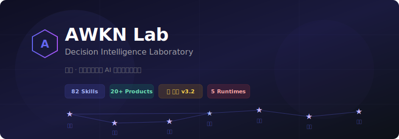

<div align="center">




<p>
  <a href="https://awkn.cn"></a>
  
  
  
  
</p>

</div>

## AWKN Lab · 觉醒式决策智能

> **一个人 + AI 工程方法论 = 一支完整团队**

AWKN = AWAKEN → Awakened Decision Intelligence（觉醒式决策智能）

我们构建了从想法到上线的全流程 AI 工程治理体系 **天枢 · DSPBRSE**——如北斗七星为旅人导航，七个阶段构成完整的工程治理闭环。



---



---



---



---



---



---

## 🚀 Quick Start

```bash
git clone https://github.com/awkn-lab/tianshu.git
```

---

<div align="center">


</div>
